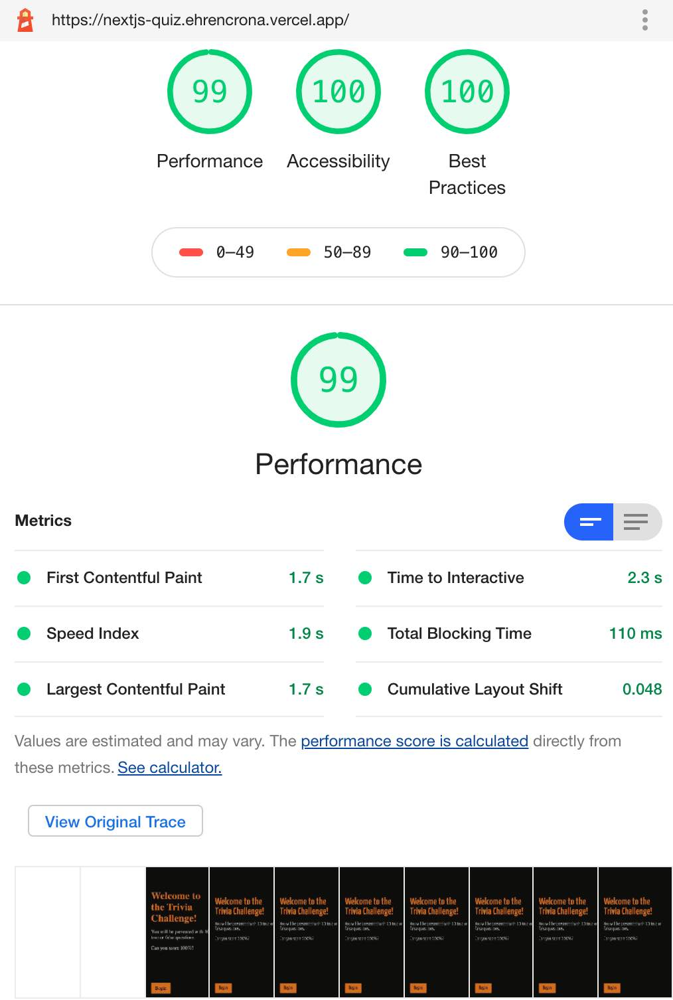
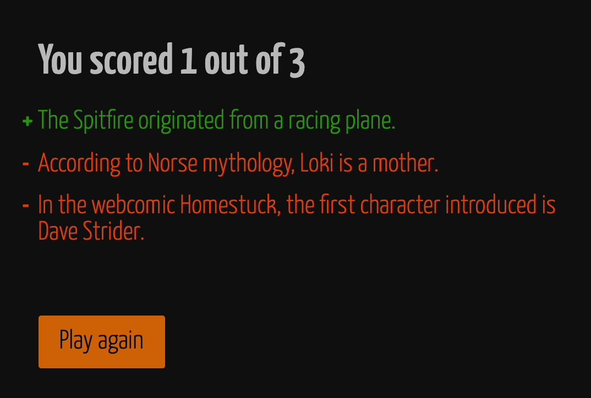

# NextJS Quiz

Small quiz app based on Next JS fetching questions from the [Open Trivia Database](opentdb.com).

Quiz data is preloaded by the server so no XHR is required to start the quiz. The request you will see in the network console is actually a pre-fetch of a second set of questions in case the user wants to restart once done.

Try it on https://nextjs-quiz.vercel.app/ 

[Tests](./__tests__) are based on React Testing Library and test at a component level.

